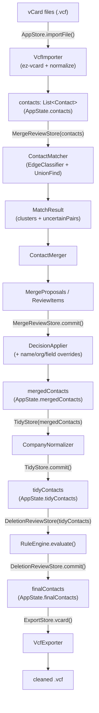
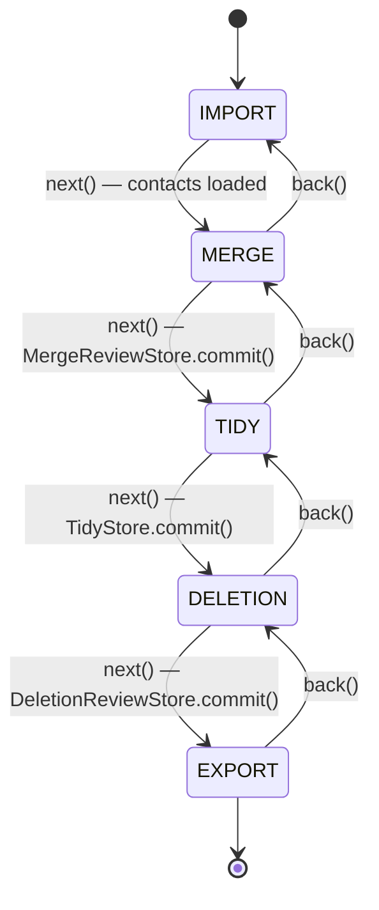
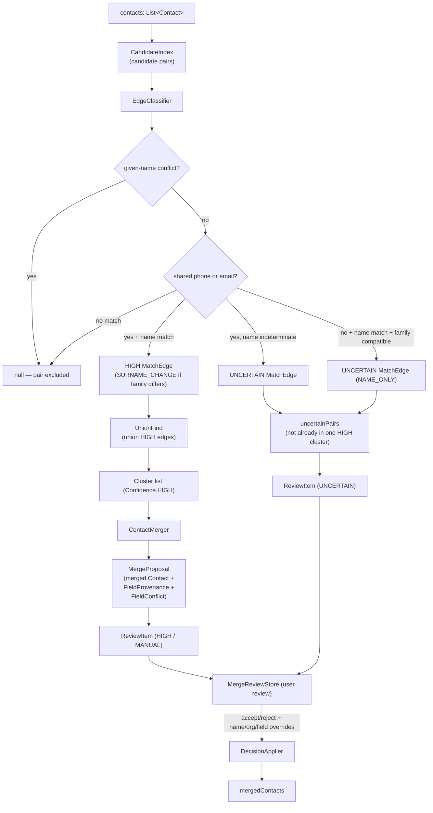
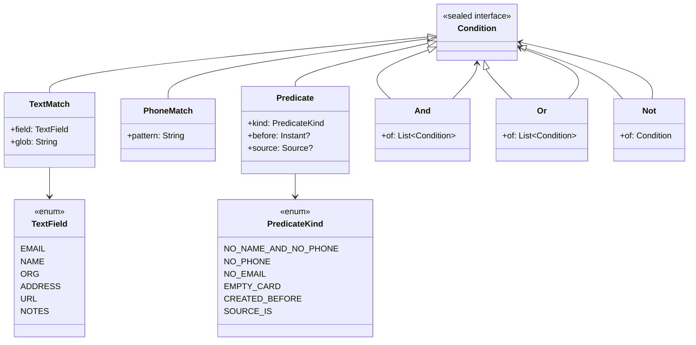

# Contactotomy — Developer Architecture

This document describes the layered architecture, package responsibilities, and data
flow for the Contactotomy codebase. Diagrams are rendered by GitHub's built-in
Mermaid support.

---

## Table of Contents

1. [Layered Architecture & Boundaries](#layered-architecture--boundaries)
2. [Module Map](#module-map)
3. [Diagrams](#diagrams)
   - [End-to-End Data Flow](#1-end-to-end-data-flow)
   - [Wizard State Machine](#2-wizard-state-machine)
   - [Merge Pipeline](#3-merge-pipeline)
   - [Rules Condition AST](#4-rules-condition-ast)
4. [Related Docs](#related-docs)

---

## Layered Architecture & Boundaries

The codebase splits into two layers that are strictly forbidden from depending on
each other in the wrong direction:

```
┌──────────────────────────────────────────────────────┐
│  ui  (Compose Desktop)                               │
│  AppStore · MergeReviewStore · TidyStore             │
│  DeletionReviewStore · ExportStore · screens         │
└────────────────────┬─────────────────────────────────┘
                     │ delegates to (one-way)
┌────────────────────▼─────────────────────────────────┐
│  core  (pure Kotlin — no Compose/Android dependency) │
│  model · normalize · importer · matcher · merger     │
│  apply · rules · company · exporter                  │
└──────────────────────────────────────────────────────┘
```

**`core` is a pure Kotlin library.** It has zero dependency on Compose, the
Android SDK, or any UI framework. This is enforced at build time by a Konsist
rule (see [`docs/adr/0006-enforce-module-boundaries-with-konsist.md`][adr-06])
that fails the test suite if any `core` class imports `androidx.*` or
`androidx.compose.*`.

**`ui` delegates all business logic to `core`.** Each wizard screen owns a
per-screen store (a plain class backed by Kotlin `StateFlow`). Stores call into
`core` engines — e.g., `MergeReviewStore` invokes `ContactMatcher`, `ContactMerger`,
and `DecisionApplier`; `DeletionReviewStore` invokes `RuleEngine`. The Compose
composables observe state flows and emit user intent back to the stores; they
contain no logic themselves.

[adr-06]: ../adr/0006-enforce-module-boundaries-with-konsist.md

---

## Module Map

### `core/model`

Defines the central data structures shared across every `core` package.
`Contact` is the canonical representation of one vCard after import, carrying
normalized phones (E.164), lowercased emails, structured `ContactName`
(prefix / given / middle / family / suffix / formatted), org, title, URLs, notes,
Google `categories`, timestamps, and the raw vCard string for lossless re-export.
`Source` (`APPLE`, `GOOGLE`, `FILE`) records the import origin.

### `core/normalize`

Phone and email normalization utilities invoked at import time and whenever
comparisons are made. `PhoneNormalizer` maps phone strings to E.164 format.
`EmailNormalizer` lowercases and trims email addresses.

### `core/importer`

`VcfImporter` parses vCard text using the **ez-vcard** library, applies
`PhoneNormalizer` and `EmailNormalizer` to every card, and returns a list of
`Contact` objects tagged with the caller-supplied `Source`. Contact IDs assigned
here are positional (`"$source-$index"`) and are namespaced by `AppStore` at
import time with a per-file prefix (`"imp0:"`, `"imp1:"`, …) so contacts from
different import sessions never collide.

### `core/matcher`

Name-gated duplicate detection. `EdgeClassifier` scores each candidate pair via
three rules: (1) conflicting given names are always excluded; (2) a positive name
match plus shared phone or email produces a `HIGH`-confidence `MatchEdge`; (3)
name match without shared contact info, or shared contact info without a definitive
name match, produces `UNCERTAIN`. Name matching logic lives in `NameMatcher`
(exact given, nickname via `NicknameDictionary`, and initial match), with
`SURNAME_CHANGE` flagged when family names differ on an otherwise-HIGH edge.
`ContactMatcher` feeds candidate pairs from `CandidateIndex` through
`EdgeClassifier`, clusters HIGH edges with `UnionFind`, then filters uncertain
pairs that are already unified inside the same HIGH cluster, and returns a
`MatchResult` containing both.

### `core/merger`

`ContactMerger` takes a `Cluster` and unions all member fields — phones, emails,
addresses, etc. — producing a `MergeProposal` that includes the merged `Contact`,
per-field `FieldProvenance` (which source cards contributed each value), and
`FieldConflict` records for scalar fields (org, title, notes) where members
disagree.

### `core/apply`

`DecisionApplier` takes all contacts, a list of accepted `MergeProposal`s, and the
corresponding `MergeDecision`s (which carry per-cluster `Action`, excluded field
values, and conflict resolutions), and returns the final deduplicated contact list
with merged contacts placed at the position of their earliest member.

### `core/rules`

A serialisable condition AST for the deletion rule engine. The sealed interface
`Condition` has six concrete types: `TextMatch` (glob match on a `TextField`),
`PhoneMatch` (phone pattern), `Predicate` (structural checks via `PredicateKind`),
`And`, `Or`, and `Not`. `RuleEngine` evaluates a `RuleSet` (list of named `Rule`s
each carrying a root `Condition`) against a contact list and returns `Flagged`
records. `RuleStore` serialises/deserialises rule sets as JSON (kotlinx.serialization).
`StarterRules` ships a default `RuleSet`. `Glob` and `PhonePattern` are the matching
primitives.

### `core/company`

`CompanyNameDetector` heuristically identifies whether a `ContactName` looks like a
company name and classifies confidence. `CompanyNormalizer` applies two tidy
transforms: `markAsCompany` moves a company-looking name into the `org` field;
`nameFromEmail` derives a display name from an email address when the name field
is blank.

### `core/exporter`

`VcfExporter` serialises a list of `Contact` objects back to vCard text, preserving
the `rawVCard` string (for fields Contactotomy does not model) and updating the
fields it does manage. Output is a single `.vcf` file suitable for import into
Apple Contacts or Google Contacts.

---

### `ui` — Wizard Screens & Stores

The UI is a five-screen wizard controlled by `AppStore`, which holds top-level
`AppState` (the current `Screen`, the accumulated contact list, and each committed
output stage). Navigation is via `AppStore.next()` / `AppStore.back()`.

| Store | Screen | Responsibility |
|---|---|---|
| `AppStore` | `IMPORT` | Imports `.vcf` files, namespaces contact IDs, manages the imported file list |
| `MergeReviewStore` | `MERGE` | Runs `ContactMatcher` + `ContactMerger`; exposes review items; `commit()` calls `DecisionApplier` and applies name/org/field overrides |
| `TidyStore` | `TIDY` | Suggests company-name and email-name normalizations; `commit()` applies `CompanyNormalizer` transforms |
| `DeletionReviewStore` | `DELETION` | Manages rule toggles, calls `RuleEngine.evaluate`, tracks per-contact approval; `commit()` calls `applyDeletions` |
| `ExportStore` | `EXPORT` | Calls `VcfExporter.export`; the composable handles the file write via `AwtFilePicker` |

`theme/` provides `AppColors`, `Dimens`, and a Material3 `Theme`. `components/`
holds reusable composables (`Badges`, `Cards`, `Fields`).

---

## Diagrams

### 1. End-to-End Data Flow



### 2. Wizard State Machine



`AppStore.next()` guards the `IMPORT → MERGE` transition: it is a no-op if
`contacts` is empty. Each `commit()` is called by the screen's Next button handler
before invoking `AppStore.next()`.

### 3. Merge Pipeline



### 4. Rules Condition AST



`ConditionEvaluator` walks the AST recursively; leaf nodes delegate to
`Glob.matches` or `PhonePattern.matches`. The AST is serialised to JSON via
kotlinx.serialization's polymorphic dispatch keyed on `@SerialName` annotations
(`"text"`, `"phone"`, `"predicate"`, `"and"`, `"or"`, `"not"`).

---

## Related Docs

### Architecture Decision Records (`docs/adr/`)

| ADR | Topic |
|-----|-------|
| [0002](../adr/0002-kotlin-compose-desktop-stack.md) | Kotlin + Compose Desktop stack choice |
| [0003](../adr/0003-vcf-file-import-export-pipeline.md) | vCard import/export pipeline |
| [0005](../adr/0005-name-gated-matching.md) | Name-gated matching strategy |
| [0006](../adr/0006-enforce-module-boundaries-with-konsist.md) | Konsist module boundary enforcement |
| [0007](../adr/0007-deletion-rule-engine.md) | Deletion rule engine design |
| [0008](../adr/0008-clustering-strategy.md) | Union-find clustering strategy |
| [0009](../adr/0009-merge-quality-gates.md) | Merge quality gates |
| [0011](../adr/0011-deletion-rule-engine-details.md) | Deletion rule engine details |
| [0013](../adr/0013-merge-review-store.md) | MergeReviewStore design |

### Design Specs & Plans (`docs/superpowers/`)

Detailed design specs live in [`docs/superpowers/specs/`](../superpowers/specs/)
and the corresponding implementation plans in
[`docs/superpowers/plans/`](../superpowers/plans/). Key specs:

- [`2026-06-23-contactotomy-design.md`](../superpowers/specs/2026-06-23-contactotomy-design.md) — overall system design
- [`2026-06-24-matching-merging-design.md`](../superpowers/specs/2026-06-24-matching-merging-design.md) — matching & merging engine
- [`2026-06-24-merge-review-design.md`](../superpowers/specs/2026-06-24-merge-review-design.md) — merge review UI/store
- [`2026-06-24-deletion-rule-engine-design.md`](../superpowers/specs/2026-06-24-deletion-rule-engine-design.md) — deletion rule engine
- [`2026-06-27-tidy-step-design.md`](../superpowers/specs/2026-06-27-tidy-step-design.md) — company/tidy step
